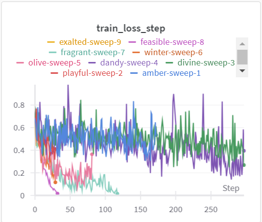
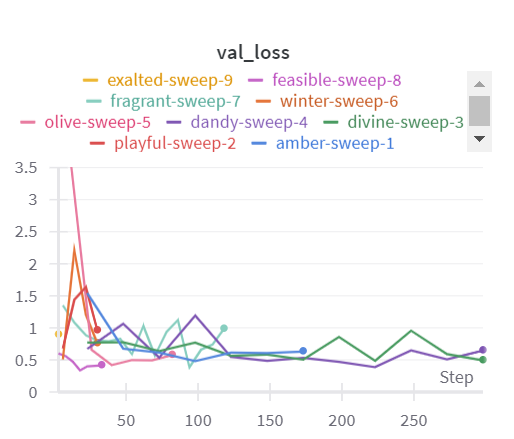
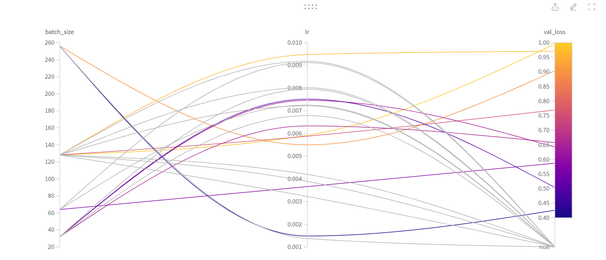

# Exam template for 02476 Machine Learning Operations

This is the report template for the exam. Please only remove the text formatted as with three dashes in front and behind
like:

```--- question 1 fill here ---```

where you instead should add your answers. Any other changes may have unwanted consequences when your report is auto
generated in the end of the course. For questions where you are asked to include images, start by adding the image to
the `figures` subfolder (please only use `.png`, `.jpg` or `.jpeg`) and then add the following code in your answer:

```markdown

```

In addition to this markdown file, we also provide the `report.py` script that provides two utility functions:

Running:

```bash
python report.py html
```

will generate an `.html` page of your report. After deadline for answering this template, we will autoscrape
everything in this `reports` folder and then use this utility to generate an `.html` page that will be your serve
as your final handin.

Running

```bash
python report.py check
```

will check your answers in this template against the constrains listed for each question e.g. is your answer too
short, too long, have you included an image when asked to.

For both functions to work it is important that you do not rename anything. The script have two dependencies that can
be installed with `pip install click markdown`.

## Overall project checklist

The checklist is *exhaustic* which means that it includes everything that you could possible do on the project in
relation the curricilum in this course. Therefore, we do not expect at all that you have checked of all boxes at the
end of the project.

### Week 1

* [X] Create a git repository
* [X] Make sure that all team members have write access to the github repository
* [X] Create a dedicated environment for you project to keep track of your packages
* [X] Create the initial file structure using cookiecutter
* [X] Fill out the `make_dataset.py` file such that it downloads whatever data you need and
* [X] Add a model file and a training script and get that running
* [X] Remember to fill out the `requirements.txt` file with whatever dependencies that you are using
* [X] Remember to comply with good coding practices (`pep8`) while doing the project
* [X] Do a bit of code typing and remember to document essential parts of your code
* [X] Setup version control for your data or part of your data
* [X] Construct one or multiple docker files for your code
* [X] Build the docker files locally and make sure they work as intended
* [X] Write one or multiple configurations files for your experiments
* [X] Used Hydra to load the configurations and manage your hyperparameters
* [X] When you have something that works somewhat, remember at some point to to some profiling and see if
      you can optimize your code
* [X] Use Weights & Biases to log training progress and other important metrics/artifacts in your code. Additionally,
      consider running a hyperparameter optimization sweep.
* [X] Use Pytorch-lightning (if applicable) to reduce the amount of boilerplate in your code

### Week 2

* [X] Write unit tests related to the data part of your code
* [X] Write unit tests related to model construction and or model training
* [ ] Calculate the coverage.
* [X] Get some continuous integration running on the github repository
* [X] Create a data storage in GCP Bucket for you data and preferable link this with your data version control setup
* [X] Create a trigger workflow for automatically building your docker images
* [X] Get your model training in GCP using either the Engine or Vertex AI
* [X] Create a FastAPI application that can do inference using your model
* [ ] If applicable, consider deploying the model locally using torchserve
* [ ] Deploy your model in GCP using either Functions or Run as the backend

### Week 3

* [ ] Check how robust your model is towards data drifting
* [ ] Setup monitoring for the system telemetry of your deployed model
* [ ] Setup monitoring for the performance of your deployed model
* [ ] If applicable, play around with distributed data loading
* [ ] If applicable, play around with distributed model training
* [ ] Play around with quantization, compilation and pruning for you trained models to increase inference speed

### Additional

* [ ] Revisit your initial project description. Did the project turn out as you wanted?
* [ ] Make sure all group members have a understanding about all parts of the project
* [ ] Uploaded all your code to github

## Group information

### Question 1
> **Enter the group number you signed up on <learn.inside.dtu.dk>**
>
> Answer:

1

### Question 2
> **Enter the study number for each member in the group**
>
> Example:
>
> *sXXXXXX, sXXXXXX, sXXXXXX*
>
> Answer:

s194369, s194340, s194331, s194349

### Question 3
> **What framework did you choose to work with and did it help you complete the project?**
>
> Answer length: 100-200 words.
>
> Example:
> *We used the third-party framework ... in our project. We used functionality ... and functionality ... from the*
> *package to do ... and ... in our project*.
>
> Answer:

We have in our project used different third-party frameworks for different functionalities. We have used Pytorch lighting to reduce boilerplate, providing a structured foundation for our model. From Timm we used the pretrained ResNet class, more specifically we used the model resnet18. We also initially used hydra to manage our hyperparameters, which we however later scrapped for instead using another third-party framework, namely Weights & Biases. W&B was for used logging training progress and conducting parameter sweeps, which helped us a lot during our project. So overall, we have in this project tried different frameworks to see what fit our project the best.

## Coding environment

> In the following section we are interested in learning more about you local development environment.

### Question 4

> **Explain how you managed dependencies in your project? Explain the process a new team member would have to go**
> **through to get an exact copy of your environment.**
>
> Answer length: 100-200 words
>
> Example:
> *We used ... for managing our dependencies. The list of dependencies was auto-generated using ... . To get a*
> *complete copy of our development environment, one would have to run the following commands*
>
> Answer:

Our packages are managed in a conda environment to manage packages, ensuring reproducibility and dependency management. The required packages for our project are in the requirements.txt file which can be found in the top folder of our projects structure which is created using cookie cutter. We also have a Makefile which includes instructions on how to set up the environment, package installation, get the data and run our model. To get a complete copy of our development environment one would have to run the following commands:
```
git clone https://github.com/luchsonice/2024_MLOps_1.git
make create_environment
make requirements
dvc pull
make data
```
After these commands the basics are set up and the model can now be run.


### Question 5

> **We expect that you initialized your project using the cookiecutter template. Explain the overall structure of your**
> **code. Did you fill out every folder or only a subset?**
>
> Answer length: 100-200 words
>
> Example:
> *From the cookiecutter template we have filled out the ... , ... and ... folder. We have removed the ... folder*
> *because we did not use any ... in our project. We have added an ... folder that contains ... for running our*
> *experiments.*
> Answer:

We have in our project used the cookiecutter template, however since we have not used all the folder and also add some folder ourself. We have made some changes compared to folder structure given from the cookiecutter template.
From the cookiecutter template we have filled out the .dvc, .github, app, configs, data, dockerfiles, reports, tests  and src folder. We have removed the notebooks folder because we did not use any notebooks in our project. We also deleted the workflows folder since we saved our workflows in the .github folder. We have added an wandb folder that contains wandb metadata and logs from running our experiments.

### Question 6

> **Did you implement any rules for code quality and format? Additionally, explain with your own words why these**
> **concepts matters in larger projects.**
>
> Answer length: 50-100 words.
>
> Answer:

In the project we have written comments. We have tried to do so that our code follows the pep8 compliant, however we have not used any checks to ensure this.
These concepts matter in large projects because when multiple people work on the code it is still important that code is in the same format and when other people (that have not worked with code before) have to use it. It is easier if the quality of the code and format is standard and the same for all the code.

## Version control

> In the following section we are interested in how version control was used in your project during development to
> corporate and increase the quality of your code.

### Question 7

> **How many tests did you implement and what are they testing in your code?**
>
> Answer length: 50-100 words.
>
> Example:
> *In total we have implemented X tests. Primarily we are testing ... and ... as these the most critical parts of our*
> *application but also ... .*
>
> Answer:

In total we have implemented 2 unit tests. The test_data and test_model files in the tests folder. In the test_data we have a few test for the data. First we test that there is the correct amount om images in test and train. We also test that the dimensions of all images are correct and lastly we test that the labels are correct. Then for the test_model file here we have one test and it tests if we get the correct output given the input. So we have a toatal of 4 tests.

### Question 8

> **What is the total code coverage (in percentage) of your code? If you code had an code coverage of 100% (or close**
> **to), would you still trust it to be error free? Explain you reasoning.**
>
> Answer length: 100-200 words.
>
> Example:
> *The total code coverage of code is X%, which includes all our source code. We are far from 100% coverage of our **
> *code and even if we were then...*
>
> Answer:

--- question 8 fill here ---

### Question 9

> **Did you workflow include using branches and pull requests? If yes, explain how. If not, explain how branches and**
> **pull request can help improve version control.**
>
> Answer length: 100-200 words.
>
> Example:
> *We made use of both branches and PRs in our project. In our group, each member had an branch that they worked on in*
> *addition to the main branch. To merge code we ...*
>
> Answer:

In the project we used branches, we used these when we were working at different parts, to both protect the main and also so it was easier when different people were implementing different parts. We would therefore also use pull request, however to make it easier the pull request would only contain one new feature. This helped making sure that we did not have to many branches at once but also making merging the branches with main easier, since it would only be a few new things. When a pull request was done we would look it over and also try the code to ensure it worked.

### Question 10

> **Did you use DVC for managing data in your project? If yes, then how did it improve your project to have version**
> **control of your data. If no, explain a case where it would be beneficial to have version control of your data.**
>
> Answer length: 100-200 words.
>
> Example:
> *We did make use of DVC in the following way: ... . In the end it helped us in ... for controlling ... part of our*
> *pipeline*
>
> Answer:

We did in our project use DVC for managing data. We first stored our data on google drive but also ended up using google cloud later on. We did use the whole dataset and did not change anything during the project so here perhaps the fact we used DVC was not so important. However if we had to add more data or change (could be only using a subset of the data) the data then DVC could have helped with that with its version control. One thing DVC did was making it easy to get the data and if someone else had to use our project it would be very easy for them to get the data, since it only requires a few commands.

### Question 11

> **Discuss you continues integration setup. What kind of CI are you running (unittesting, linting, etc.)? Do you test**
> **multiple operating systems, python version etc. Do you make use of caching? Feel free to insert a link to one of**
> **your github actions workflow.**
>
> Answer length: 200-300 words.
>
> Example:
> *We have organized our CI into 3 separate files: one for doing ..., one for running ... testing and one for running*
> *... . In particular for our ..., we used ... .An example of a triggered workflow can be seen here: <weblink>*
>
> Answer:

For continues integration, we incorporated GitHub workflows into our project infrastructure, to help ensure our commitment to code quality and reliability. As mentioned before we had 4 test, these were in unit test. These test were run with a github work flow: .github\workflows\tests.yml. Which were done each time a a pull-request or a push on the main branch. This ensured both the data and the model was working. We also had a workflow to create the relevant docker files (these also mentioned before). Link to this workflow: .github\workflows\docker-image.yml, this again was done whenever a pull-request or a push on the main branch. With these workflows help us to have a continues integration.

## Running code and tracking experiments

> In the following section we are interested in learning more about the experimental setup for running your code and
> especially the reproducibility of your experiments.

### Question 12

> **How did you configure experiments? Did you make use of config files? Explain with coding examples of how you would**
> **run a experiment.**
>
> Answer length: 50-100 words.
>
> Example:
> *We used a simple argparser, that worked in the following way: python my_script.py --lr 1e-3 --batch_size 25*
>
> Answer:

In our project we had a configs folder in which a configuration file was. It had the hyperparamters: the batch size of the model, learning rate and number of epochs. The configuration file was used by:
```
 batch_size = config['batch_size']
lr = config['lr']
num_epochs = config['num_epochs']
```
For Weights and Biases the configuration file is simply just given in the WandbLogger(config=config).

### Question 13

> **Reproducibility of experiments are important. Related to the last question, how did you secure that no information**
> **is lost when running experiments and that your experiments are reproducible?**
>
> Answer length: 100-200 words.
>
> Example:
> *We made use of config files. Whenever an experiment is run the following happens: ... . To reproduce an experiment*
> *one would have to do ...*
>
> Answer:

In our project we made use of config files for hyperparameters and we used wandb. This makes it easy to see what parameters are used to train with. To be able to track the parameters we used wandb. In our github repository we have a folder called wandb, which has a config file that has our parameters. Also in wandb it is possible to see all experimentes run with the hyperparameters used. So to reproduce an experiment one would update the configs files in the folder configs with the parameters from the experimnet which they want to reproduced found using either the folder wandb or on the wandb website. To be able reproduce the exact results one would also need to set a seed in the config file.

### Question 14

> **Upload 1 to 3 screenshots that show the experiments that you have done in W&B (or another experiment tracking**
> **service of your choice). This may include loss graphs, logged images, hyperparameter sweeps etc. You can take**
> **inspiration from [this figure](figures/wandb.png). Explain what metrics you are tracking and why they are**
> **important.**
>
> Answer length: 200-300 words + 1 to 3 screenshots.
>
> Example:
> *As seen in the first image when have tracked ... and ... which both inform us about ... in our experiments.*
> *As seen in the second image we are also tracking ... and ...*
>
> Answer:

In W&B there is many different things there is tracked. So, for this report we have chosen three different tracks to show the experiments we have done in W&B. The first tracked we have chosen is the training loss.
<br />
We can see that we have a decrease in the training loss. The training loss is good for seeing how our model is learning when training on the training data and if perhaps we need to change anything in or model. With the training loss we will be able to detect if the model is overfitting. The training loss however only tells us about what happens when train so to get a better understanding of the model we also need to look outside the training so the next track is of the validation loss.<br />
<br />
Here we see the validation loss, again we see it for different runs. The validation loss is important since it monitor performance when presented with data the model has not trained on. And is there for important together with the train loss to understand the model’s performance. The last tracking, we include in this report is the sweep of the hyperparameters.
<br />
Which is good for seeing more in-depth information about the hyperparameters and how to tune them.

### Question 15

> **Docker is an important tool for creating containerized applications. Explain how you used docker in your**
> **experiments? Include how you would run your docker images and include a link to one of your docker files.**
>
> Answer length: 100-200 words.
>
> Example:
> *For our project we developed several images: one for training, inference and deployment. For example to run the*
> *training docker image: `docker run trainer:latest lr=1e-3 batch_size=64`. Link to docker file: <weblink>*
>
> Answer:

In our project, reproducibility is very important. To address this, we chose to use Docker files. This choice was motivated by the desire to create an environment that is consistent and easily replicable across various devices and platforms. By using Docker in our project, it helps to ensure that our entire workflow, from model training to predictions, remains reproducible and consistent. For our project, we have created specific Docker files for model training and model prediction. These Docker files contains the necessary dependencies, libraries, and configurations. The link to our two docker files (for model and prediction) are: xxx and xxxx

### Question 16

> **When running into bugs while trying to run your experiments, how did you perform debugging? Additionally, did you**
> **try to profile your code or do you think it is already perfect?**
>
> Answer length: 100-200 words.
>
> Example:
> *Debugging method was dependent on group member. Some just used ... and others used ... . We did a single profiling*
> *run of our main code at some point that showed ...*
>
> Answer:

When running into bugs in the project we used different things we have used print statements but also used pdb,cProfile and Pytorch Lightning debugger to debug the code. However when using the debugger it did not result in a clear statement what the underlying problem were. This was due to the fact that built-in functions took much of the time and whitout changing the source code there is no way to improve (even if, the built-in functions are often already optimal). Another case was where we ran out of memory, giving us different results when profiling each run. Hence, we tried removing elements in our code until we found the error. Profiling added some value in this project but not as much as it could

## Working in the cloud

> In the following section we would like to know more about your experience when developing in the cloud.

### Question 17

> **List all the GCP services that you made use of in your project and shortly explain what each service does?**
>
> Answer length: 50-200 words.
>
> Example:
> *We used the following two services: Engine and Bucket. Engine is used for... and Bucket is used for...*
>
> Answer:

We used the following GCP services: Compute Engine VM instances, Buckets, Cloud Run, as well as Service Accounts.

VM instances are used to outsource computations and further have adjustable resources in regards to the number of cores and memory.

Buckets are Cloud Storages with access control.

Cloud Run is a service that allows us to deploy an application as a Docker container. In our case we use it to host our API for our deployed model. We also initially tried using Cloud Functions for our model deployment, which is a service that allows to write event-triggered functions, in our case when uploading an image a function is triggered which returns the prediction of the model. However we ran into issues using Functions and ended up using Run instead.

### Question 18

> **The backbone of GCP is the Compute engine. Explained how you made use of this service and what type of VMs**
> **you used?**
>
> Answer length: 100-200 words.
>
> Example:
> *We used the compute engine to run our ... . We used instances with the following hardware: ... and we started the*
> *using a custom container: ...*
>
> Answer:

We used the compute engine to run our sweeps and training, where sweeps (with 20 runs) were run on the high cpu instance and lower-intensive tasks were run on the simpler instance. Since the model craved more than 4GB of memory we had to upgrade to the 8GB memory hardware. We used instances with the following hardware:
2vCPU (1 core) 8GB memory (e2-standard-2)
16vCPU (8 core) 16 GB memory (e2-highcpu-16)
tried to use: GPU P100

The GPU did not work for us as the CUDA Driver was outdated and we did not have permissions to upgrade the driver. Other GPUs which might have newer drivers were unable in several regions we tested.

All instances were initiated using
    --image-family=pytorch-latest-cpu \
    --image-project=deeplearning-platform-release

### Question 19

> **Insert 1-2 images of your GCP bucket, such that we can see what data you have stored in it.**
> **You can take inspiration from [this figure](figures/bucket.png).**
>
> Answer:


### Question 20

> **Upload one image of your GCP container registry, such that we can see the different images that you have stored.**
> **You can take inspiration from [this figure](figures/registry.png).**
>
> Answer:


### Question 21

> **Upload one image of your GCP cloud build history, so we can see the history of the images that have been build in**
> **your project. You can take inspiration from [this figure](figures/build.png).**
>
> Answer:
[my_image](figures/build.png)


### Question 22

> **Did you manage to deploy your model, either in locally or cloud? If not, describe why. If yes, describe how and**
> **preferably how you invoke your deployed service?**
>
> Answer length: 100-200 words.
>
> Example:
> *For deployment we wrapped our model into application using ... . We first tried locally serving the model, which*
> *worked. Afterwards we deployed it in the cloud, using ... . To invoke the service an user would call*
> *`curl -X POST -F "file=@file.json"<weburl>`*
>
> Answer:

We managed to deploy our model in the cloud. We did this by first building a FastAPI application that loads the trained model from our bucket, and we can do inference on images we upload. This FastAPI was first made to run locally, and when this was working we built a docker image that automatically starts the application. When trying to run the image locally we ran into issues with getting the right permissions for accessing gdrive inside the container, but we did not have these issues once it was deployed in the cloud. To deploy, we pushed our docker image to the Container Registry and created a Cloud Run service that runs the container. Finally, we set up continuous deployment such that the docker image is automatically built every time we push to the main branch, ensuring that we do not need to manually build the image every time.

To invoke our service, a user makes a POST request to our API uploading an image. This can be done with the following command, where `image.jpg` should be replaced with the path to the desired image file:
```
curl -X "POST" \
  "https://project-image-for-deploy-rpbxq26uca-ew.a.run.app/inference/" \
  -H "accept: application/json" \
  -H "Content-Type: multipart/form-data" \
  -F "data=@image.jpg;type=image/jpeg"
```
or it can be done through [the docs page](https://project-image-for-deploy-rpbxq26uca-ew.a.run.app/docs).

### Question 23

> **Did you manage to implement monitoring of your deployed model? If yes, explain how it works. If not, explain how**
> **monitoring would help the longevity of your application.**
>
> Answer length: 100-200 words.
>
> Example:
> *We did not manage to implement monitoring. We would like to have monitoring implemented such that over time we could*
> *measure ... and ... that would inform us about this ... behaviour of our application.*
>
> Answer:

We did not manage to implement monitoring; it would have been great if we have had the time to implement it. However, we spent our time on different things. Monitoring would have been great to being able to measure if our model’s performance over time, to ensure that it the model continue to work well over time. Monitoring can also be useful to detect drifting for the data. Another reason implementing monitoring would have been good is to monitor the system this could be useful to get an insight in our system and how many request are the application receiving and the time the application runs per request. This is important because it can help with optimization of performance aswell as detecting issues.

### Question 24

> **How many credits did you end up using during the project and what service was most expensive?**
>
> Answer length: 25-100 words.
>
> Example:
> *Group member 1 used ..., Group member 2 used ..., in total ... credits was spend during development. The service*
> *costing the most was ... due to ...*
>
> Answer:

We used one account for this project which in total spent $3.42 whilst developing the model and it's deployment. The high cpu instance was most expensive with an hourly rate of 0.44$ and in the end being 96.8% of the total cost. Least expensive were the Functions with $0.01.

## Overall discussion of project

> In the following section we would like you to think about the general structure of your project.

### Question 25

> **Include a figure that describes the overall architecture of your system and what services that you make use of.**
> **You can take inspiration from [this figure](figures/overview.png). Additionally in your own words, explain the**
> **overall steps in figure.**
>
> Answer length: 200-400 words
>
> Example:
>
> *The starting point of the diagram is our local setup, where we integrated ... and ... and ... into our code.*
> *Whenever we commit code and puch to github, it auto triggers ... and ... . From there the diagram shows ...*
>
> Answer:
[my_image](figures/architecture.png)

The starting point of the diagram is our local setup, where we integrated Pytorch Lightning, Conda, Weights and Biases and Hydra into our code. We ended up replacing Hydra with Weights and Biases for our config files, hence it is crossed out. The template of this setup was created using CookieCutter. The development of code was done with the help of Profilers (cProfiler, Pytorch Lightning and pdb). To version control the code we loaded everything into github and for the data into a bucket in Cloud Storage using dvc.

Whenever we commit code and push to github, it auto triggers github actions performing unit tests and testing whether docker builds an image. Furthermore the Cloud Build is triggered to automatically build a docker image which contionously is pushed to the container registry. From there the diagram shows that this image is consumed by Cloud Run running the container using a virutal machine. The end user makes a request to fastapi application which runs in Cloud Run.

Hence, due to continous integration the user automatically always gets the latest model pushed to main.

### Question 26

> **Discuss the overall struggles of the project. Where did you spend most time and what did you do to overcome these**
> **challenges?**
>
> Answer length: 200-400 words.
>
> Example:
> *The biggest challenges in the project was using ... tool to do ... . The reason for this was ...*
>
> Answer:

In our project we did have some different struggles at different times. In the beginning we struggled with getting our model and training on the data to work. We spent quite a bit of time to get TIMM to work and tried other things before going back and getting TIMM to work. Then after this our next struggle was with Pytorch Lighting this we also spent quite a lot of time on. This was because there was a lot of things we needed to rewrite and get it to log the correct things. So, the struggle here was rewriting our code and get it to work where we therefor also spent some time on debugging. Our third struggle was the github actions, here we had the problem with get the actions to give us check marks, and we also struggled here with the service accounts for docker and getting the dvc pull actions.
The last struggle we had and the biggest were in the deployment, here we spent a lot of time on different problems. We had one problem with the memory in the virtual machine, which end up giving us an error message, that did not really make sense. To overcome our struggles in the project we mainly asked a TA for help, we did this after we had tried different things such as using google and ChatGPT. The solutions to a lot of our struggles in the deployment, was small things such as adding extra memory or specifying the region/zone our code had to run on.


### Question 27

> **State the individual contributions of each team member. This is required information from DTU, because we need to**
> **make sure all members contributed actively to the project**
>
> Answer length: 50-200 words.
>
> Example:
> *Student sXXXXXX was in charge of developing of setting up the initial cookie cutter project and developing of the*
> *docker containers for training our applications.*
> *Student sXXXXXX was in charge of training our models in the cloud and deploying them afterwards.*
> *All members contributed to code by...*
>
> Answer:

s194369:
s194340:
s194331:
s194349:
